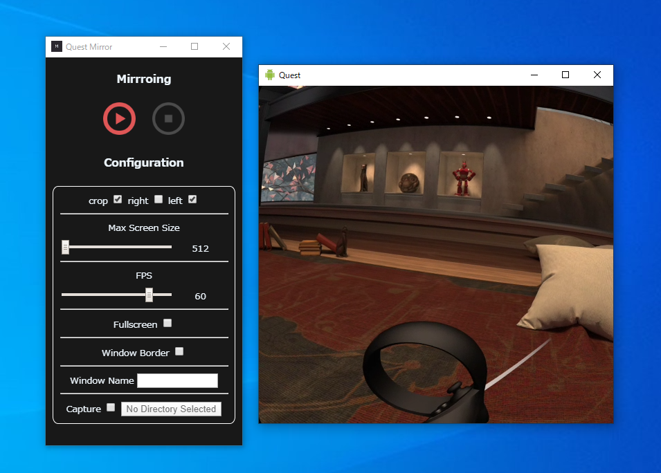
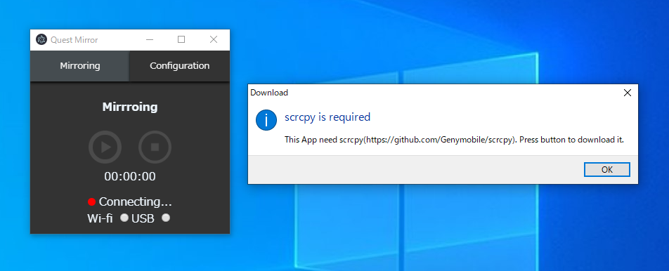
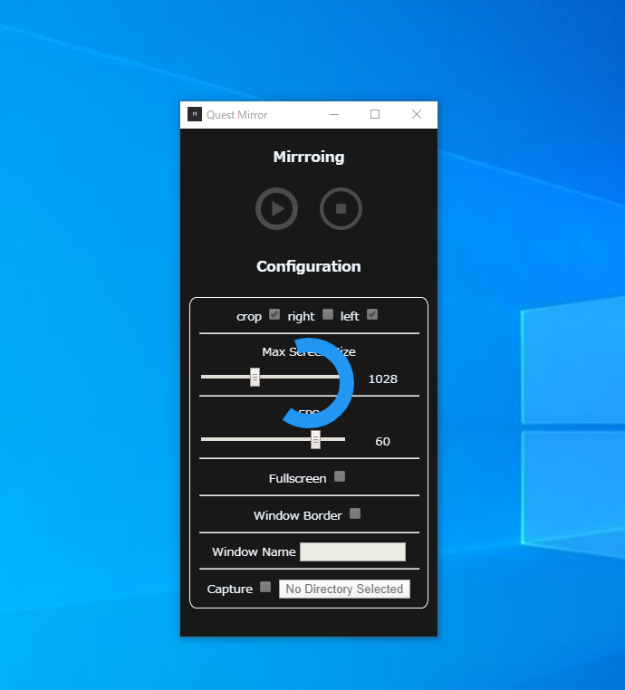

# QuestMirror
A GUI application with scrcpy for mirroing Oculus Quest. 



# Introduction

Oculus Quest can be mirrored using scrcpy, but it takes time for a child or family to easily mirror it.
This app calls scrcpy from Electron for easy mirroring by kids and anyone.

# Installation

It is better to use the pre-built package of links for easier execution.
Unzip the zip file and click **QuestMirror.exe** in the unzipped folder.

Pre-build: https://github.com/r-asada-ab/QuestMirror/releases/download/v1.0.0/quest-mirror-win32-x64.zip

## Build 

If you want to build it yourself, follow the steps below.

```
git clone git@github.com:r-asada-ab/QuestMirror.git
cd questmirror
npm install
npm start
```

When the app launches, the app first automatically downloads the scrcpy pre-built files from Github(See below).

https://github.com/Genymobile/scrcpy/releases/download/v1.13/scrcpy-win64-v1.13.zip


# Instructions

When the application starts, the application downloads scrcpy, so press the OK button.



Wait for the download to complete.



Once downloaded, connect Oculus Quest to your PC. At this time, keep Oculus Quest in developer mode.

After connecting Oculus Quest, press the play button to start mirroring.

# Configuration

## crop

Oculus Quest shows a composite of the left and right renders. If you want to see either left or right, check crop and select left or right.

## Max Screen Size

Move the slider to change the screen size. You can select from 512 to 1980.

## FPS

Move the slider to change the FPS. You can select from 5 to 72.

## FullScreen

Check it if you want to perform mirroring in full screen.

## Window Border

Check if you want to erase the window title or button of the application.

## Window Name

If you want to set the window title of the application, put your favorite window title here.

## Capture

If you want to record the mirroring, check it and specify the folder to save the video.

# Licences

* scrcpy
https://github.com/Genymobile/scrcpy  
Apache License 2.0(http://www.apache.org/licenses/LICENSE-2.0)

* LoadinSpinner
https://github.com/ZulNs/LoadingSpinner.js  
MIT License(https://github.com/ZulNs/LoadingSpinner.js/blob/master/LICENSE)
